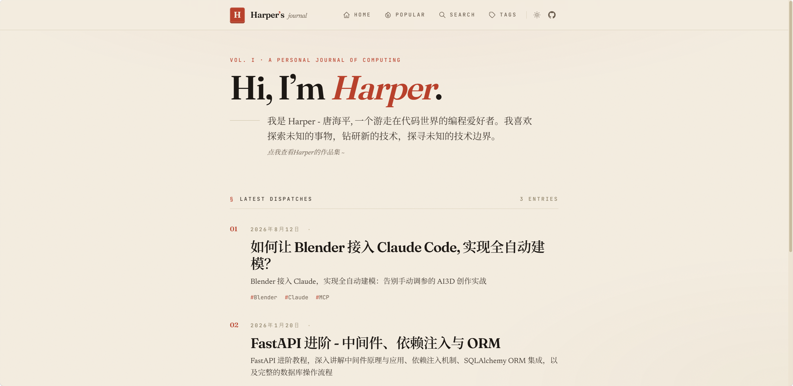

<h1 align="center">Harper’s Blog</h1>

<p align="center">
  
  
  <a href="https://astro.build"></a>
</p>

<p align="center">
  <a href="https://github.com/thp322"></a>
  <a href="https://harperlog.cn"></a>
</p>

<p align="center">
  <a href="https://harperlog.cn/">在线访问</a> |
  <a href="#技术栈">技术栈</a> |
  <a href="#项目结构">项目结构</a> |
  <a href="#本地开发">本地开发</a> |
  <a href="#添加文章">添加文章</a> |
  <a href="#技术特性">技术特性</a>
</p>

<p align="center">
  <a href="https://harperlog.cn/"></a>
</p>

基于 [Astro](https://astro.build) 的个人博客，使用 TypeScript + Tailwind CSS v4。

## 技术栈

- **框架**: Astro v5 (静态站点)
- **样式**: Tailwind CSS v4 + @tailwindcss/typography
- **内容**: Markdown + Content Collections + LaTeX (KaTeX)
- **语法高亮**: Shiki (github-dark) + 代码复制
- **图表**: Mermaid（客户端渲染）
- **搜索**: 客户端实时搜索
- **统计**: Umami Analytics (自托管)
- **部署**: Docker + Nginx + GitHub Actions

## 项目结构

```
src/
├── content/posts/              # Markdown 文章
├── components/
│   ├── Image.astro             # 图片优化
│   ├── Pagination.astro        # 分页导航
│   ├── PrevNext.astro          # 上一篇/下一篇
│   ├── TableOfContents.astro   # 文章目录（侧栏，滚动高亮）
│   └── ViewCounter.astro       # 访问量统计
├── layouts/BaseLayout.astro    # 全局布局（含暗黑模式切换）
├── pages/
│   ├── index.astro             # 首页（分页，5 篇/页）
│   ├── page/[page].astro       # 分页页
│   ├── posts/[…slug].astro     # 文章详情
│   ├── tags/index.astro        # 标签总览
│   ├── tags/[tag].astro        # 标签筛选
│   ├── popular.astro           # 热门文章（按访问量排序）
│   ├── search.astro            # 搜索页（按年份归档 + 实时筛选）
│   ├── search.json.ts          # 搜索索引（构建时生成）
│   └── 404.astro               # 404
└── styles/global.css           # 设计系统（Ink & Vellum / Ink & Midnight 双主题令牌）
```

## 本地开发

```bash
npm install
npm run dev          # http://localhost:4321
npm run build        # 生产构建
npx astro check      # TypeScript 类型检查
```

## 添加文章

```bash
# 从 Obsidian 导入（自动转换图片、修正日期）
npm run import "path/to/article.md"

# 提交 → GitHub Actions 自动部署
git add -A && git commit -m "new post" && git push
```

手动创建：在 `src/content/posts/` 下新建 `.md`，frontmatter：

```yaml
---
title: 文章标题
date: 2026-08-13
tags: [标签1, 标签2]
description: 文章摘要
---
```

支持 LaTeX 公式（`$...$` / `$$...$$`），代码块自动高亮并带复制按钮。

## 技术特性

- **Ink & Vellum / Ink & Midnight 双主题**：编辑风设计系统，暖羊皮纸亮色 + 暖午夜暗色，一键切换并跟随系统偏好
- Fraunces + Newsreader 衬线字体排版，首字下沉、编辑式章节标号、朱砂印章红点缀
- 暗黑模式切换（localStorage 持久化、跨标签页同步、防 FOUC）
- Shiki 代码高亮 + 一键复制（终端式暗色代码块，双主题下保持编辑对比）
- Mermaid 图表渲染
- LaTeX 数学公式（KaTeX）
- 客户端实时搜索 + 按年份归档
- 标签系统 + 热门排行（按访问量）+ 分页
- 文章目录侧栏（滚动高亮）+ 阅读时间 + 上一篇/下一篇导航
- 访问量统计（Umami，含本地缓存）
- SEO（Open Graph / Twitter Card / JSON-LD / Sitemap / og:image）
- 纯 CSS 移动端汉堡菜单
- 页脚备案信息（湘ICP备2025140854号 / 湘公网安备43082102000226号）
