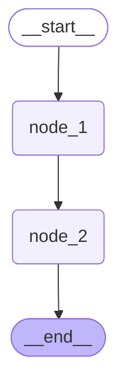

LangChain 链式开发能够快速搭建基础 RAG 与简单对话智能体，但无法满足企业复杂、多步骤、带分支判断、需状态留存的真实业务场景。真实企业 Agent 需要自主任务规划、循环迭代推理、条件分支路由、断点续跑与人工审核介入能力。

**LangGraph 作为 LangChain 生态的高阶编排框架**，补齐了传统线性 Chain 的短板，以状态图模型驱动智能体运行，是构建生产级、可落地、可迭代企业 AI Agent 的核心技术。

本文从原理到实战，完整讲解 LangGraph 核心机制、状态管理、节点与边逻辑、Agent 循环推理范式，手把手带你从入门 Chain 开发，进阶到工业级智能体应用开发。

---

## 一、LangGraph 简介

### 为什么 LangGraph 是 AI 开发者的必修课？

AI Agent 已成下一代应用范式，LangGraph 是 Agent 的“操作系统”

- Agent：下一代应用范式
- Runtime：可靠持久化，执行引擎
- HITL：人机协同，生产级能力

$$
LangGraph  = 高层 Agent 抽象(create-agent)
$$

$$
LangGraph = 底层执行引擎与 Agent Runtime
$$

### LangGraph vs LangChain 定位对比

各司其职，协同构建 AI Agent 应用

| 对比维度 | LangChain             | LangGraph                      |
| -------- | --------------------- | ------------------------------ |
| 定位     | Agent 高层开发框架    | 底层编排框架 & Agent Runtime   |
| 核心入口 | create_agent          | StateGraph / @entrypoint       |
| 适用场景 | 结构直接的 Agent 应用 | 复杂工作流、持久化、长时间运行 |
| 流程控制 | Agent 循环自动管理    | 精细控制节点、边、条件分支     |
| 学习成本 | 较低                  | 较高（但能力上限更高）         |

大多数项目从 LangChain 的 create_agent 开始；需要复杂编排时引入 LangGraph

## 二、环境配置

### 安装依赖

**LangGraph 全家桶：**

| 包名                            | 用途                         |
| :------------------------------ | :--------------------------- |
| `langgraph`                     | LangGraph 核心库，构建状态图 |
| `langgraph-prebuilt`            | 预置的 Agent 组件            |
| `langgraph-checkpoint`          | 检查点（Checkpoint）机制     |
| `langgraph-checkpoint-postgres` | PostgreSQL 持久化检查点      |
| `langgraph-sdk`                 | LangGraph Python SDK         |

**LangChain 全家桶：**

| 包名                  | 用途                  |
| :-------------------- | :-------------------- |
| `langchain`           | LangChain 核心        |
| `langchain-core`      | LangChain 基础抽象    |
| `langchain-community` | 社区集成              |
| `langchain-openai`    | OpenAI 集成           |
| `langchain-deepseek`  | DeepSeek 集成         |
| `langchain-anthropic` | Anthropic Claude 集成 |

**模型服务商 SDK：**

| 包名                      | 用途                    |
| :------------------------ | :---------------------- |
| `openai`                  | OpenAI 官方 SDK         |
| `anthropic`               | Anthropic 官方 SDK      |
| `dashscope`               | 阿里百炼（Qwen 等模型） |
| `tencentcloud-sdk-python` | 腾讯云 SDK              |

**其他重要依赖：**

| 包名                     | 用途                         |
| :----------------------- | :--------------------------- |
| `fastapi` / `uvicorn`    | Web 服务框架，部署时使用     |
| `pydantic`               | 数据校验，状态定义时大量使用 |
| `httpx` / `httpx-sse`    | HTTP 客户端 + SSE 流式支持   |
| `loguru`                 | 日志库                       |
| `python-dotenv`          | 读取 `.env` 环境变量文件     |
| `tiktoken`               | OpenAI 的 token 计数工具     |
| `SQLAlchemy` / `psycopg` | 数据库操作，持久化时使用     |
| `pymilvus`               | Milvus 向量数据库客户端      |

### 配置 API Key

在这里我们使用 **DeepSeek** 大模型，需要配置 DeepSeek 的 API Key

### 获取 DeepSeek API Key

1. 打开 DeepSeek 开放平台：https://platform.deepseek.com/
2. 注册 / 登录账号
3. 进入 **API Keys** 页面，点击 **创建 API Key**
4. 复制生成的 key（形如 `sk-xxxxxxxx`），注意 key **只显示一次**，请立即保存

### 创建 .env 文件

为了不与之前我们配置的千问大模型 api 冲突，我们在项目根目录下新建 `.env` 文件，填入以下内容：

```
# ============================================
# 使用 DeepSeek 模型
# ============================================
DEEPSEEK_API_KEY=sk-你的DeepSeek_API_Key

# ============================================
# 可选：其他模型服务商（如需切换模型时使用）
# ============================================
# OPENAI_API_KEY=sk-你的OpenAI_API_Key
# ANTHROPIC_API_KEY=sk-ant-你的Anthropic_API_Key

# ============================================
# 部署时需要
# ============================================
# LANGSMITH_API_KEY=lsv2-pt-你的LangSmith_API_Key
# LANGSMITH_TRACING=true
# LANGSMITH_ENDPOINT=https://api.smith.langchain.com
# LANGSMITH_PROJECT="langgraph-tutorial"
```

> `.env` 文件已在 `.gitignore` 中排除，**不会被提交到 Git**，可以放心保存密钥。

### 代码中如何读取 .env

```python
from dotenv import load_dotenv
load_dotenv(override=True)
```

之后创建模型客户端时，SDK 会自动从环境变量中读取对应的 API Key，无需在代码中硬编码：

```
from langchain_deepseek import ChatDeepSeek

# API Key 自动从 DEEPSEEK_API_KEY 环境变量读取
model = ChatDeepSeek(model="deepseek-v4-flash")
```

## 三、LangGraph 总览

LangGraph 运行时底层基于自研的 Pregel 运行时，其核心思想借鉴了 Google Pregel 计算模型，用于组织和执行复杂的图计算流程

### LangGraph 和 LangChain 的版本迭代及定位

**LangChain 1.x** 的定位发生了明显变化：旧式 Chain、Retriever、Memory 等组件被迁移至 langchain-classic；LCEL 保留为 langchain-core 的底层组合机制，但不再是主要开发入口

**LangChain 1.x** 现在聚焦于 Agent 开发，核心入口是 create_agent，围绕 Agent 提供模型、工具、消息、结构化输出、Middleware 和记忆管理等高层抽象

**LangGraph** 是更底层的编排框架与 Agent Runtime，负责复杂工作流和有状态 Agent 的执行，提供持久化、流式输出、Durable Execution、Human-in-the-loop 等运行时能力。create_agent 底层基于 LangGraph 实现

二者的定位对比如下：

| 对比维度 | LangChain             | LangGraph                                    |
| :------- | :-------------------- | :------------------------------------------- |
| 定位     | Agent 高层开发框架    | 底层编排框架 & Agent Runtime                 |
| 核心入口 | `create_agent`        | `StateGraph` / `@entrypoint`                 |
| 适用场景 | 结构直接的 Agent 应用 | 复杂工作流、持久化状态、长时间运行、人工介入 |
| 流程控制 | Agent 循环自动管理    | 精细控制节点、边、条件分支                   |
| 学习成本 | 较低                  | 较高                                         |

`LangChain` 提供易于使用的 Agent 高层抽象，`LangGraph` 提供可靠、可持久化且可精细控制的底层执行能力

对于大多数 Agent 项目，从 LangChain 的 create_agent 开始即可；需要复杂工作流编排、确定性步骤与 Agent 步骤混合、长时间运行或底层状态控制时，再引入 LangGraph


### 构成图的基本要素

LangGraph 运行时主要由三个基本要素构成：State（状态）、Node（节点） 和 Edge（边）

State（状态）：LangGraph 运行过程中的共享数据结构，用于表示应用在某一时刻的状态快照。它承载了图运行所需的上下文信息、中间结果和后续节点需要读取的数据，是节点之间传递信息的核心载体。它与我们在学习 LangChain Agent 时使用的 State 是同一概念

Node（节点）：LangGraph 中的具体执行单元，通常实现为一个函数。节点会读取当前 State，执行相应的业务逻辑，并返回对 State 的局部更新。节点本身并不直接修改全局状态，状态的合并与提交由运行时统一完成

Edges（边）：用于定义节点之间的流转关系，决定一个节点执行完成后下一步应该进入哪个节点。Edge 可以是固定流转，也可以根据当前 State 进行条件判断，从而实现分支、循环等复杂控制流程

下图展示了一个非常简单的运行图，只有两个计算节点，其拓扑结构为：

```
START --> node_1 --> node_2 --> END
```

如下图所示：


### 图运行过程

LangGraph 的图运行过程基于 Superstep（超步） 来组织和推进。Superstep 可以理解为图运行过程中的一次”单步循环”。一次图运行过程从开始到结束，就是由一系列连续的 Superstep 串联而成

下文以 **node_1 执行完毕后的 Superstep** 为例说明

每个 Superstep 通常可以分为三个阶段：

1. 计划/路由阶段（Plan / Routing）：根据当前的 State（状态） 和 Edge（边） 的逻辑，确定本轮超步中应该被执行的节点

   

2. 执行阶段（Execution）：运行本轮被选中的节点。如果本轮有多个节点同时被触发，它们会并行执行。每个节点都会基于本轮开始时的状态快照进行计算，并输出各自对状态的局部更新。在本阶段中，一个节点产生的更新不会立即被其他节点读取到

   

3. 状态更新/提交阶段（Update / Commit）：当本轮所有节点都执行完成后，LangGraph 会将它们的输出统一合并到 State 中，生成新的状态快照。这个新状态会作为下一轮 Superstep 的输入


其中和 Checkpoint 相关的部分，后续再介绍

### API 风格

#### Graph API vs Functional API

LangGraph 提供了两种不同的 API 来构建运行图：`Graph API`（图式 API） 和 `Functional API`（函数式 API）。这两种 API 共享相同的底层运行时，可以在同一应用程序中协同使用，但它们针对不同的使用场景和开发偏好而设计

####  Graph API

Graph API 采用声明式方式构建工作流。开发者需要显式定义 State、Node 和 Edge，将业务流程组织成一个可视化的图结构

当流程中存在较复杂的分支、多个节点之间共享状态、并行执行、结果汇聚，或者需要通过图结构帮助调试和团队协作时，更适合使用 Graph API。官方文档也明确建议，在需要复杂流程可视化、显式状态管理、多条件分支、并行路径以及团队协作时，优先选择 Graph API

总之：

> Graph API 更适合构建结构清晰、节点关系复杂、需要长期维护的工作流

典型场景包括：

| 场景               | 说明                                               |
| :----------------- | :------------------------------------------------- |
| 多节点复杂流程     | 流程中存在多个处理节点，需要清晰表达节点之间的关系 |
| 条件分支较多       | 根据 State 中的不同字段决定后续执行路径            |
| 并行执行与结果汇聚 | 多个节点并行运行，之后汇总结果                     |
| 多组件共享状态     | 多个节点都需要读写同一个全局 State                 |
| 需要图结构展示     | 便于调试、讲解、文档化和团队协作                   |

#### Functional API

Functional API 采用命令式方式构建工作流，更接近普通 Python 函数调用。开发者可以使用 `@entrypoint` 定义工作流入口，使用 `@task` 定义可被检查点记录的任务，然后在函数内部使用普通的 `if/else`、循环和函数调用来组织流程。官方文档指出，当已有过程式代码需要最小改造、流程主要是线性的、分支逻辑较简单、希望快速原型验证时，更适合使用 Functional API

可以这样理解：

> Functional API 更适合在普通 Python 函数流程中，以较低成本接入 LangGraph 的持久化、中断恢复和任务记录能力

典型场景包括：

| 场景           | 说明                                               |
| :------------- | :------------------------------------------------- |
| 现有代码改造   | 原本已有函数式或过程式代码，不希望重构成完整图结构 |
| 线性流程       | 主要是 A → B → C 的顺序执行                        |
| 简单分支       | 只有少量 `if/else` 判断                            |
| 快速原型验证   | 希望减少样板代码，快速验证业务逻辑                 |
| 局部任务持久化 | 希望某些函数作为独立 task 被检查点记录             |

#### 二者的核心区别

| 对比项     | Graph API                      | Functional API                   |
| :--------- | :----------------------------- | :------------------------------- |
| 编程风格   | 声明式图结构                   | 命令式函数流程                   |
| 核心抽象   | State、Node、Edge              | entrypoint、task                 |
| 状态管理   | 显式定义全局 State             | 更多依赖函数参数和返回值         |
| 流程表达   | 通过节点和边表达               | 通过普通 Python 控制流表达       |
| 可视化能力 | 强，天然适合画图和调试         | 弱，更像普通代码流程             |
| 适合场景   | 复杂工作流、多分支、多节点协作 | 简单流程、快速原型、已有代码改造 |
| 学习成本   | 相对更高                       | 相对更低                         |

#### 选型建议

从零构建或流程结构复杂，用 `Graph API`；现有代码改造、快速原型验证或流程逻辑简单，用 `Functional API`

学习 `LangGraph` 建议优先掌握 `Graph API`。因为后者更能体现 `LangGraph` 的核心思想：通过 `State、Node、Edge` 显式描述一个可执行的计算图

本文介绍 `Graph API`，对 `Functional API` 感兴趣的同学自行查阅

> https://docs.langchain.com/oss/python/langgraph/functional-api

## 四、LangGraph 代码开发

### 1、基础的 graph 流程

<p id="基础的graph流程"></p>

```python
from langgraph.graph import StateGraph,START,END
from typing import TypedDict, Annotated
from operator import add

# 1 定义状态
class OverAllState(TypedDict):
    # 日志类型还是 list[str]  更新的方式不是覆盖, add 是追加
    logs: Annotated[list[str],add]
    cur_id: str

# 2 定义节点
def node_1(state:OverAllState) -> OverAllState:
    pre_id = state["cur_id"]
    return {
        "logs": ["node_1 运行完毕"],
        "cur_id": pre_id + ", node_1"
    }

def node_2(state:OverAllState) -> OverAllState:
    pre_id = state["cur_id"]
    return {
        "logs": ["node_2 运行完毕"],
        "cur_id": pre_id + ", node_2"
    }

# 3 定义边
# 3.1 创建图 获取建造者
builder = StateGraph(state_schema=OverAllState)
# 3.2 添加节点
builder.add_node(node_1)
builder.add_node(node_2)
# 3.3 添加边
builder.add_edge(START,"node_1")
builder.add_edge("node_1","node_2")
builder.add_edge("node_2",END)

# 4 获取图
graph = builder.compile()

# 5 运行图
result = graph.invoke({"cur_id":"start"})

print(result)
```

```
{'logs': ['node_1 运行完毕', 'node_2 运行完毕'], 'cur_id': 'start, node_1, node_2'}
```

### 2、图结构可视化

#### 绘制 mermaid 并获取源码

mermaid 是一种生成图表和流程图的文本标记语言，它可以把简单的文本描述直接渲染成可视化图形

通过以下代码可以用 mermaid 语法表达图结构，并打印 mermaid 源码

```python
raw_mermaid = graph.get_graph().draw_mermaid()
print(raw_mermaid)
```

将输出复制到 markdown 文档代码块中， 选择语言为“mermaid”：



#### 绘制 mermaid 并转换为 png

Langgraph 也支持将 mermaid 转换为图片字节流：

```python
png_bytes = graph.get_graph().draw_mermaid_png()
```

`draw_mermaid_png()`底层会先调用`draw_mermaid()`得到mermaid语法的图表代码，然后调用在线服务渲染为mermaid图片。

默认的mermaid在线渲染服务链接为：[https://mermaid.ink](https://mermaid.ink/)，由于网络问题可能存在渲染失败的情况，通常重试即可成功。

可以通过`draw_mermaid_png()`的`base_url`参数替换可用的mermaid在线渲染服务


#### 保存为图片文件

```python
png_bytes = graph.get_graph().draw_mermaid_png()
png_filename = 'first_demo_graph.png'
with open(png_filename, "wb") as f:
    f.write(png_bytes)
```

#### 快捷用法

在 `Jupyter` 环境下，可以直接使用 `display(graph)` 快速展示编译后的图结构：

```python
from IPython.display import display
display(graph)
```

### 3、图的状态（State）管理 —— 状态规约

#### 状态定义

状态的定义实际上是在声明状态的 Schema，后者是状态字段的完整描述

官方推荐了三种定义 Schema 的方式：TypedDict、dataclass、Pydantic

##### TypedDict

代码见“<a href="#基础的graph流程">基础的 graph 流程</a>”

##### dataclass

属性调用方式由`['字段名']`变为 `.字段名`

```python
from langgraph.graph import StateGraph, START, END
from typing import Annotated
from dataclasses import dataclass
from operator import add

@dataclass
class OverAllState:
    logs: Annotated[list[str], add]
    cur_id: str

def node_1(state: OverAllState) -> OverAllState:
    pre_id = state.cur_id
    return {
        "logs": ["node_1 运行完毕"],
        "cur_id": pre_id + ", node_1"
    }
    """
    return OverAllState{
        "logs": ["node_1 运行完毕"],
        "cur_id": pre_id + ", node_1"
    }
    """

def node_2(state: OverAllState) -> OverAllState:
    pre_id = state.cur_id
    return {
        "logs": ["node_2 运行完毕"],
        "cur_id": pre_id + ", node_2"
    }

builder = StateGraph(state_schema=OverAllState)
builder.add_node("node_1", node_1)
builder.add_node("node_2", node_2)
builder.add_edge(START, "node_1")
builder.add_edge("node_1", "node_2")
builder.add_edge("node_2", END)

graph = builder.compile()

result = graph.invoke({"cur_id":"start"})
# result = graph.invoke(OverAllState([], "start"))

print(result)
```

##### Pydantic

Pydantic 模型的字段访问方式和 dataclass 相同

```python
from langgraph.graph import StateGraph, START, END
from typing import Annotated
from pydantic import BaseModel
from operator import add

class OverAllState(BaseModel):
    logs: Annotated[list[str], add]
    cur_id: str

def node_1(state: OverAllState) -> OverAllState:
    pre_id = state.cur_id
    return {
        "logs": ["node_1 运行完毕"],
        "cur_id": pre_id + ", node_1"
    }

def node_2(state: OverAllState) -> OverAllState:
    pre_id = state.cur_id
    return {
        "logs": ["node_2 运行完毕"],
        "cur_id": pre_id + ", node_2"
    }

builder = StateGraph(state_schema=OverAllState)
builder.add_node("node_1", node_1)
builder.add_node("node_2", node_2)
builder.add_edge(START, "node_1")
builder.add_edge("node_1", "node_2")
builder.add_edge("node_2", END)

graph = builder.compile()

print(graph.invoke({"cur_id": "start"}))
```

##### 校验行为

学习 LangChain 的结构化输出时我们提到：Pydantic 对格式要求最严格，如果模型返回的内容不符合结构化 Schema 的要求，则抛出 `ValidationError`。而其余方式都不会对模型的返回结果进行校验，即便模型返回的内容不符合结构化要求，也会原样返回给用户

而作为 LangGraph 计算图的状态时，这三种方式都要求字段名称完全一致。只是处理方式不同

具体规则如下：

##### （1）输入字段不匹配

- TypedDict 将输入字段视为字典的 `Key`，不匹配时抛出 `KeyError`异常
- dataclass 将输入字段视为类的`属性`，不匹配时抛出`TypeError（类型错误）`异常
- Pydantic 对输入字段进行校验，不匹配时抛出 `ValidationError` 异常

##### （2）节点返回字段不匹配

图节点返回的是对于状态的更新，如果返回字段和状态字段不匹配，上述三种Schema定义方式的行为是统一的：状态更新会被忽略

##### 推荐用法

在实际使用中，推荐优先使用 `TypedDict` 定义 LangGraph 状态图的 State Schema

大多数官方案例也采用 `TypedDict` 方式定义状态 `Schema`。这种方式写法简洁、结构清晰，能够直接描述状态中包含哪些字段，以及每个字段对应的数据类型，非常适合用于定义图运行过程中的共享状态

相比普通 `dict`，`TypedDict` 可以提供更明确的字段约束和类型提示；相比 `dataclass`，`TypedDict` 更贴近 LangGraph 中状态的更新方式，因为节点通常返回的是表示“部分状态更新”的字典，而不是完整对象；相比 `Pydantic BaseModel`，它又更加轻量，不会引入额外的数据校验开销。因此，在没有复杂校验需求的情况下，`TypedDict` 是定义 LangGraph State Schema 的首选方式

#### State Reducer

State Reducer 是 LangGraph 中用于合并状态更新的核心机制。在 LangGraph 的 `StateGraph` 中，每个节点可以读取和写入共享状态，而 Reducer 定义了如何将多个节点对同一状态键的更新合并

Reducer 的核心特征：

- 函数签名：`(Value, Value) -> Value`，接收当前值和更新值，返回合并后的新值
- 注解定义：通过 `Annotated[Type, reducer_function]` 为状态键指定 Reducer
- 默认行为：未指定 Reducer 的状态键使用覆盖策略（Last-Write-Wins）

#### 如何定义 Reducer

##### 定义Reducer函数

Reducer 本质上是一个二元合并函数，用于定义当同一个字段产生多个更新值时，LangGraph 应该如何将这些值合并为一个最终结果

函数签名：`(Value, Value) -> Value`

示例代码如下：

```python
# left: 从最开始的位置合并到当前节点的位置的值
# right: 当前节点的值
# 返回值: 合并后的值
def my_reducer(left: list[str],right: list[str]) -> list[str]:
    
    return left + right

# 1. node1 运行之后的值
left = ["start","node_1 运行完毕"]
right = ["node_2 运行完毕"]

# 2. 合并
merged = my_reducer(left,right)

print(merged)
```

其中，`my_reducer` 用于处理 `list[str]` 类型的数据。它接收两个列表参数：

- `left`：当前已累计的状态值
- `right`：本次待合并的新值

函数内部通过 `left + right` 将两个列表合并，并返回合并后的结果

因此，该 Reducer 的作用是：当某个状态字段存在多次列表更新时，将这些列表内容追加合并，而不是直接覆盖原值

运行结果如下：

```
['a', 'b', 'c']
```

##### 将 Reducer 和状态字段关联

在 LangGraph 中，Reducer 通常通过 Python 的 `typing.Annotated` 与状态字段进行关联

`Annotated[]` 是 Python 提供的一种类型注解扩展机制，用于在原始类型之外附加额外的元数据信息。需要注意的是，`Annotated[]` 本身并不规定这些元数据的具体含义，它只负责在类型注解中保留这些信息

严格来说，`Annotated` 的第一个参数是被注解的原始类型，后续参数是附加的元数据。至于这些元数据表示什么、如何解析，则由使用它的框架或工具自行决定

在 LangGraph 中，框架利用这一机制，将状态字段的类型和 Reducer 规则同时声明在字段定义中。其基本形式如下：

```python
Annotated[Type, reducer_function]
```

其中：

- `Type`：表示状态字段的数据类型
- `reducer_function`：表示该字段对应的 Reducer 函数

示例代码如下：

```python
from typing import TypedDict, Annotated

class OverAllState(TypedDict):
    logs: Annotated[list[str], my_reducer]
    cur_id: str
```

在上述代码中：

- `logs` 字段的类型是 `list[str]`
- `my_reducer` 是与 `logs` 字段关联的 Reducer 函数
- 当多个节点同时更新 `logs` 字段时，LangGraph 会使用 `my_reducer` 将多个列表合并
- `cur_id` 字段没有指定 Reducer，因此采用默认更新规则

##### 常用内置 Reducer 函数

###### 1. operator.add

`operator.add` 是 Python 内置的加法操作函数，底层由 C 实现

它接收两个参数，等价于 `a（第一个参数）+ b（第二个参数）`

代码如下：

```python
from operator import add

print(f"{add(1,2) = }")
print(f"{add([1,2], [3,4]) = }")
print(f"{add(['a','b'], ['c']) = }")
```

输出如下：

```
add(1,2) = 3
add([1,2], [3,4]) = [1, 2, 3, 4]
add(['a','b'], ['c']) = ['a', 'b', 'c']
```

###### 2. langgraph.graph.message.add_messages

`add_messages` 是 LangGraph 中专用于合并消息列表的 Reducer 函数，常用于维护对话历史类的状态字段。其函数签名如下：

```python
def add_messages(
    left: Messages,
    right: Messages,
    *,
    format: Literal["langchain-openai"] | None = None,
) -> Messages:
    ...
    return merged
```

参数说明：

- `left`：状态中已有的消息列表
- `right`：当前节点返回的消息更新值
- `format`：可选参数，用于指定返回消息的格式，通常无需手动设置

`left` 与 `right` 的类型均为 `Messages`。`Messages` 可以理解为 LangChain 消息对象的列表，其中每个元素都是 `BaseMessage` 或其子类的实例，常见子类包括：

- `HumanMessage`：用户的输入消息
- `AIMessage`：AI 的回复消息
- `SystemMessage`：系统提示消息
- `ToolMessage`：工具调用的结果消息

`add_messages` 处理的是对话消息序列，而非普通的字符串列表

`BaseMessage` 包含一个可选的 `id` 属性，用于唯一标识一条消息。`add_messages` 在合并 `left` 与 `right` 时，不是简单地执行列表拼接，而是依据消息的 `id` 进行合并：

- 若 `right` 中的某条消息的 `id` 在 `left` 中不存在，则将该消息追加到结果列表末尾
- 若 `right` 中的某条消息的 `id` 与 `left` 中已有消息的 `id` 相同，则使用 `right` 中的新消息替换 `left` 中的旧消息

因此，`add_messages` 的作用可以概括为：在保留历史消息的基础上追加新消息，并允许通过相同的消息 `id` 覆盖已有消息

需要特别说明，`add_messages` 并非简单地对 `left` 与 `right` 求“并集”。更准确地说，它是一个基于消息 `id` 的消息列表合并函数：既支持追加新消息，也支持更新已有消息

可以理解为：

```
merged = left + right
```

但若 `right` 中存在与 `left` 相同 `id` 的消息，则最终结果中不会出现重复消息，而是用 `right` 中的消息覆盖 `left` 中对应的旧消息（**即使消息类型不同，只要 id 相同就会覆盖**）

示例代码如下：

```python
from langgraph.graph.message import add_messages
from langchain.messages import HumanMessage, AIMessage, SystemMessage

left = [
    SystemMessage(content="你是个善解人意的助手", id='1'),
    HumanMessage(content="你好", id='2'),
    AIMessage(content="你好~", id='3'),
]

right = [
    HumanMessage(content="我是老王，你是小王", id='2'),
    AIMessage(content="好的，我记住啦", id='3'),
    HumanMessage(content="你是谁？", id='4'),
    AIMessage(content="我是小王", id='5'),
]

merged = add_messages(left, right)

for msg in merged:
    print(msg)
```

输出如下：

```
content='你是个善解人意的助手' additional_kwargs={} response_metadata={} id='1'
content='我是老王，你是小王' additional_kwargs={} response_metadata={} id='2'
content='好的，我记住啦' additional_kwargs={} response_metadata={} id='3' tool_calls=[] invalid_tool_calls=[]
content='你是谁？' additional_kwargs={} response_metadata={} id='4'
content='我是小王' additional_kwargs={} response_metadata={} id='5' tool_calls=[] invalid_tool_calls=[]
```

####  默认行为

如果某个 State 字段没有显式定义 `Reducer`，LangGraph 会使用默认的状态更新行为：后一次更新值会覆盖该字段原有的状态值。

换句话说，当节点返回的更新结果中包含某个字段时，如果该字段没有配置 Reducer，LangGraph 不会对新旧值进行追加、合并或累加，而是直接使用本次返回的新值替换原来的旧值

示例代码如下：

```python
from langgraph.graph import StateGraph, START, END
from typing import TypedDict

class OverAllState(TypedDict):
    logs: list[str]
    id: str

def node_a(state: OverAllState):
    return {
        "logs": ["node_a"],
        "id": "node_a"
    }

def node_b(state: OverAllState):
    return {
        "logs": ["node_b"],
        "id": "node_b"
    }

builder = StateGraph(state_schema=OverAllState)
builder.add_node("node_a", node_a)
builder.add_node("node_b", node_b)
builder.add_edge(START, "node_a")
builder.add_edge("node_a", "node_b")
builder.add_edge("node_b", END)

graph = builder.compile()
result = graph.invoke({"logs": ["START"], "id": "start"})

print(result)
```

输出下

```
{'logs': ['node_b'], 'id': 'node_b'}
```

可以看到，`logs`字段和`id`字段都没有定义`Reducer`，因此，节点返回的新值会覆盖初始状态中的旧值，图运行结果中的状态值和最后一次更新保持一致

### 4、节点中访问 State

#### 图节点中读取 State

在 LangGraph 中，节点本质上是一个可调用对象，通常定义为普通 Python 函数。节点函数被执行时，LangGraph 会自动将当前图运行到该节点时的 `State` 传入节点函数。

节点函数的第一个参数通常是当前运行图的状态对象，也就是 `State`

```python
def node(state: StateSchema):
    ...
```

其中，`state` 表示当前节点执行时可以访问到的全局状态快照。节点可以通过读取 `state` 中的字段获取上游节点写入的数据，并基于这些数据完成当前节点的业务逻辑

示例代码如下：

```python
from typing import TypedDict,Annotated
from operator import add
from langgraph.graph import StateGraph,START,END

# 1. 定义状态
class OverAllState(TypedDict):
    logs:Annotated[list[str],add]
    cur_id: str

# 2. 定义节点
def node_1(state:OverAllState) -> OverAllState:
    for k,v in state.items():
        print(f"k:{k} v:{v}")
    # return state
    return {
        "cur_id":"node_1"
    }

builder = StateGraph(state_schema=OverAllState)
builder.add_node("node_1",node_1)
builder.add_edge(START,"node_1")
builder.add_edge("node_1",END)

graph = builder.compile()
result = graph.invoke({"logs":["start"],"cur_id":"start"})

print(result)
```

输出如下：

```
k:logs v:['start']
k:cur_id v:start
{'logs': ['start'], 'cur_id': 'node_1'}
```

#### 图节点更新 State

在 LangGraph 中，节点函数通常不需要返回更新后的完整状态，只需要返回本节点对状态的局部更新。

也就是说，节点的返回值可以只包含需要修改的状态字段

- 对于节点没有返回的字段，LangGraph 会保留其原有状态值
- 对于节点返回的字段，LangGraph 会根据该字段是否配置了 `Reducer` 来决定如何合并更新值
  - 如果字段配置了 `Reducer`，则使用对应的 `Reducer` 函数将旧值和新值合并
  - 如果字段没有配置 `Reducer`，则按照默认规则使用节点返回的新值覆盖原值

LangGraph运行时会按照状态字段的 `Reducer` 函数将其与当前的最新状态合并

示例代码如下：

```python
from langgraph.graph import StateGraph, START, END
from typing import TypedDict, Annotated
from operator import add

class OverAllState(TypedDict):
    logs: Annotated[list[str], add]
    id: str

def node_a(state: OverAllState):
    for k, v in state.items():
        print(f"k: {k}, v: {v}")
    return {
        "logs": ["node_a 更新状态"]
    }

builder = StateGraph(state_schema=OverAllState)
builder.add_node("node_a", node_a)
builder.add_edge(START, "node_a")
builder.add_edge("node_a", END)

graph = builder.compile()
result = graph.invoke({"logs": ["START"], "id": "start"})
print('=' * 30, '-> result <-', '=' * 30)
print(result)
```

输出如下：

```
k: logs, v: ['START']
k: id, v: start
============================== -> result <- ==============================
{'logs': ['START', 'node_a 更新状态'], 'id': 'start'}
```

在上述示例中：

- `logs` 字段通过 `Annotated[list[str], add]` 绑定了 Reducer 函数 `operator.add`，因此 LangGraph 会将原有的 `logs` 值和 `node_a` 返回的新 `logs` 值进行列表拼接：

```
["START"] + ["node_a 更新状态"]
```

最终得到：

```
["START", "node_a 更新状态"]
```

- `id` 字段没有出现在 `node_a` 的返回值中，因此该字段不会被更新。图运行结束后，输出状态中的 `id` 仍然保持输入时的值：

```
"id": "start"
```

因此，LangGraph 节点更新 State 的核心规则可以概括为：

> 节点只返回需要更新的字段；未返回的字段保持不变；返回的字段根据是否配置 Reducer 决定是合并还是覆盖

#### Overwrite 绕过 Reducer

在前面的示例中，如果某个状态字段定义了 `Reducer`，那么节点返回该字段的更新值时，LangGraph 默认会通过对应的 `Reducer` 将新值与已有状态值进行合并

在某些场景下，我们可能并不希望继续执行 `Reducer` 的聚合逻辑，而是希望本次更新直接覆盖旧值。这时可以使用 `Overwrite`

`Overwrite` 的作用是：告诉 LangGraph 本次状态更新不走该字段原本定义的 `Reducer`，而是直接用新值覆盖状态中的旧值

需要注意的是，`Overwrite` 只影响当前这一次更新，并不会修改状态字段本身的 `Reducer` 定义。后续节点如果继续正常返回该字段的更新值，仍然会按照原来的 `Reducer` 逻辑进行合并

示例代码如下：

```python
from typing import TypedDict,Annotated
from operator import add
from langgraph.graph import StateGraph,START,END
from langgraph.types import Overwrite

# 1. 定义状态
class OverAllState(TypedDict):
    # 归约的方式是add追加合并
    logs:Annotated[list[str],add]
    cur_id: str

# 2. 定义节点
def node_1(state:OverAllState) -> OverAllState:
    for k,v in state.items():
        print(f"k:{k} v:{v}")
    return {
        "logs":["node_1 运行完毕"]
    }

def node_2(state:OverAllState) -> OverAllState:
    for k,v in state.items():
        print(f"k:{k} v:{v}")
    return {
        "logs":Overwrite(["node_2 运行完毕"])
    }

def node_3(state:OverAllState) -> OverAllState:
    for k,v in state.items():
        print(f"k:{k} v:{v}")
    return {
        "logs":["node_3 运行完毕"]
    }

builder = StateGraph(state_schema=OverAllState)
builder.add_node("node_1",node_1)
builder.add_node("node_2",node_2)
builder.add_node("node_3",node_3)
builder.add_edge(START,"node_1")
builder.add_edge("node_1","node_2")
builder.add_edge("node_2","node_3")
builder.add_edge("node_3",END)

graph = builder.compile()
result = graph.invoke({"logs":["start"],"cur_id":"start"})

print(result)
```

输出如下：

```
k:logs v:['start']
k:cur_id v:start
k:logs v:['start', 'node_1 运行完毕']
k:cur_id v:start
k:logs v:['node_2 运行完毕']
k:cur_id v:start
{'logs': ['node_2 运行完毕', 'node_3 运行完毕'], 'cur_id': 'start'}
```

上述代码中：

`logs` 字段绑定了 `operator.add()` 函数

- 如果没有 `Overwrite`，则最终输出的 `logs` 的值应为 `['START', 'node_a', 'node_b', 'node_c']`
- `node_b` 返回更新时，用 `Overwrite` 包裹了 `logs` 字段的值，那么当前状态的 `logs` 会被 `["node_b"]` 覆盖，因此最终输出的 `logs` 字段值变成了 `['node_b', 'node_c']`

`id` 字段按照默认行为，保留最后一次更新的值

#### 节点的并行执行

```python
from time import sleep
from typing import TypedDict,Annotated
from operator import add
from langgraph.graph import StateGraph,START,END
from langgraph.types import Overwrite

# 1. 定义状态
class OverAllState(TypedDict):
    # 归约的方式是 add 追加合并
    logs:Annotated[list[str],add]
    # 如果出现并行节点 同时更新状态 往下游节点传递的时候 必须要有 reducer
    cur_id: Annotated[str,add]

# 2. 定义节点
def node_1(state:OverAllState) -> OverAllState:
    for k,v in state.items():
        print(f"1k:{k} v:{v}")
    return {
        "logs":["node_1 运行完毕"]
    }

def node_2(state:OverAllState) -> OverAllState:
    for k,v in state.items():
        print(f"2k:{k} v:{v}")
    return {
        "logs":["node_2 运行完毕"],
        "cur_id":"node2"
    }

def node_3(state:OverAllState) -> OverAllState:
    sleep(1)
    for k,v in state.items():
        print(f"3k:{k} v:{v}")
    return {
        "logs":["node_3 运行完毕"],
        "cur_id":"node3"
    }

def node_4(state:OverAllState) -> OverAllState:
    sleep(2)
    for k,v in state.items():
        print(f"4k:{k} v:{v}")
    return {
        "logs":["node_4 运行完毕"]
    }

builder = StateGraph(state_schema=OverAllState)
builder.add_node("node_1", node_1)
builder.add_node("node_2", node_2)
builder.add_node("node_3", node_3)
builder.add_node("node_4", node_4)
builder.add_edge(START, "node_1")
builder.add_edge("node_1", "node_2")
builder.add_edge("node_1", "node_3")
builder.add_edge("node_2", "node_4")
builder.add_edge("node_3", "node_4")
builder.add_edge("node_4", END)

graph = builder.compile()

result = graph.invoke({"logs": ["START"], "cur_id": "start"})
print('=' * 30, '-> result <-', '=' * 30)
print(result)
```

### 5、Multi Schema 用法

#### 状态类型

`LangGraph` 支持在一个图中使用多个状态 Schema，用于区分图的外部输入、外部输出、内部共享状态以及节点间的临时状态

常见状态类型可以分为以下几类：

- 全局状态 / 内部状态：图内部主要使用的状态，创建 `StateGraph` 时传递给 `state_schema` 参数。它通常包含图运行过程中需要读写的大部分字段
- 输入状态：图对外接收输入时使用的状态，创建 `StateGraph` 时传递给 `input_schema` 参数。它用于约束调用图时允许传入哪些字段
- 输出状态：图最终对外返回结果时使用的状态，创建 `StateGraph` 时传递给 `output_schema` 参数。它用于约束图运行结束后只返回哪些字段
- 私有状态：图内部节点之间传递的临时状态，通常不作为图的输入，也不作为图的最终输出。它可以通过节点函数的入参类型注解声明，并在节点返回值中写入

需要注意，输入状态和输出状态主要面向图的边界，即“图如何接收外部输入”和“图如何返回外部结果”；而全局状态和私有状态主要面向图内部节点之间的数据传递

#### 状态之间的关系

##### 设计规范

本节主要说明 `LangGraph` 状态设计中的规范。以下规则属于工程上的最佳实践，违反这些规范未必一定导致程序报错，但容易降低代码的可读性和可维护性

1. 输入状态和输出状态通常应是全局状态的子集 

   输入状态描述图对外需要接收的数据，输出状态描述图最终需要返回的数据。通常情况下，它们都应该是全局状态的一部分

   例如：

   ```python
   class InputState(TypedDict):
       username: str
   
   class OutputState(TypedDict):
       graph_output: str
   
   class OverAllState(TypedDict):
       username: str
       nickname: str
       graph_output: str
   ```

   其中，`InputState` 和 `OutputState` 的所有字段均存在于 `OverAllState` 中

2. 私有状态和全局状态应尽量避免字段重名 

   私有状态的定位是图内部某些节点之间传递的临时字段。如果私有状态字段和全局状态字段重名，虽然某些情况下程序仍然可以运行，但容易让人误以为该字段是全局共享字段，从而造成理解混乱。 因此，推荐让私有状态字段和全局状态字段保持清晰边界

3. 节点函数应明确声明入参状态类型和返回状态类型 

   节点函数的第一个参数通常是当前节点可读取的状态。通过类型注解声明该参数，可以明确表达该节点需要读取哪些字段。 同时，给节点函数声明返回状态类型，也可以帮助阅读者理解该节点会更新哪些字段

   例如：

   ```python
   def node_1(state: InputState) -> OverAllState:
       return {
           "nickname": "Dear " + state["username"]
       }
   ```

4. 节点函数中不应该访问入参状态类型中不存在的字段 

   节点实际接收到的状态会按照其入参类型进行裁剪。因此，如果节点入参声明为 `InputState`，就不应该在节点内部访问 `InputState` 中不存在的字段

    例如：

   ```python
   def node_1(state: InputState) -> OverAllState:
       return {
           "nickname": state["username"]
       }
   ```

   如果在该函数中访问：

   ```
   state["nickname"]
   ```

   而 `nickname` 不属于 `InputState`，运行时就可能抛出 `KeyError`

5. 节点函数返回的字典应尽量和返回类型注解保持一致 

   从 Python 类型注解的角度看，函数返回类型只是静态提示，运行时不会自动强制校验。 从 LangGraph 的运行机制看，节点返回的是对状态的部分更新，不是完整状态。只要返回字段已经被图记录为可用状态字段，LangGraph 就可以将其作为状态更新处理。 不过，从工程规范上讲，节点返回字典中的字段最好和函数返回类型注解保持一致，这样更利于阅读、调试和维护

##### 源码层面的约束

本节从底层机制角度说明 `LangGraph` 如何记录、裁剪和更新状态

###### 状态的记录

`LangGraph` 的状态并不是简单保存在一个普通字典中，而是会被拆分成多个可读写的状态字段。每个状态字段在底层通常对应一个 `Channel`

这些状态字段会在不同阶段被记录到状态图中

1. `StateGraph` 记录状态字段的核心方法是 `_add_schema()` 

   `_add_schema()` 会解析传入的状态 Schema，并将其中声明的字段记录到图中，使这些字段成为图运行时可以读写的状态字段

2. 创建 `StateGraph` 时，会记录 `state_schema`、`input_schema` 和 `output_schema` 中的字段 当创建状态图时：

   ```python
   builder = StateGraph(
       OverAllState,
       input_schema=InputState,
       output_schema=OutputState
   )
   ```

   LangGraph 会解析这些 Schema，并将其中涉及的字段加入图的状态管理体系，如果没有填 `input_schema` 或 `output_schema` ，则等效于 `OverAllState`：

   ```python
   builder = StateGraph(
       OverAllState,
       input_schema=OverAllState,
       output_schema=OverAllState
   )
   ```

3. 调用 `add_node()` 添加节点时，也可能记录节点入参声明的状态 Schema 当添加节点时，`LangGraph` 会根据节点函数第一个参数的类型注解推断该节点的输入状态类型。 如果这个输入状态类型之前没有被图记录过，LangGraph 也会通过 `_add_schema()` 将其加入图中。 这也是私有状态能够生效的原因

   例如：

   ```python
   class PrivateState(TypedDict):
       greeting: str
   
   def node_3(state: PrivateState) -> OutputState:
       return {
           "graph_output": state["greeting"]
       }
   ```

   当 `node_3` 被添加到图中时，`PrivateState` 中的 `greeting` 字段会被记录到图中，从而成为图内部可以传递的状态字段

4. 总结

   - 全局状态、输入状态、输出状态通常在创建 `StateGraph` 时被记录
   - 私有状态通常在调用 `add_node()` 添加节点时，根据节点入参类型注解被记录
   - 被记录后的状态字段，底层会成为图运行时可以读写的状态字段

##### 状态的访问

1. 调用图时，输入会按照 `input_schema` 进行约束 当调用图时：

   ```python
   graph.invoke({"username": "小黄"})
   ```

   如果创建图时声明了 `input_schema`，那么外部输入会按照 `input_schema` 进行约束。 如果没有声明 `input_schema`，则通常按照 `state_schema` 作为图的输入 Schema。 因此，`input_schema` 的作用不是“只让第一个节点可见”，而是约束图的外部输入结构。 此处的约束是指：按照 `schema` 裁剪输入，只保留 `schema` 中出现的状态字段

2. 节点接收到的状态会按照节点入参类型进行裁剪 每个节点能读取哪些字段，主要取决于该节点第一个参数的类型注解

    例如：

   ```python
   def node_1(state: InputState) -> OverAllState:
       ...
   ```

   此时，`node_1` 接收到的 `state` 会按照 `InputState` 进行裁剪。即使图的全局状态中还有其他字段，`node_1` 也不应该访问不属于 `InputState` 的字段。 如果访问了入参状态中不存在的字段

   例如：

   ```python
   state["nickname"]
   ```

   就可能抛出：

   ```python
   KeyError
   ```

3. 节点返回的是状态更新，而不是完整状态 节点函数不需要返回完整状态，只需要返回本节点想要更新的字段

   例如：

   ```python
   def node_1(state: InputState) -> OverAllState:
       return {
           "nickname": "Dear " + state["username"]
       }
   ```

   这里虽然返回类型注解是 `OverAllState`，但函数实际只返回了 `nickname` 一个字段。这是允许的，因为 LangGraph 会把节点返回值视为对状态的部分更新

4. 节点返回值的应用主要由字段名称和图中已记录的状态字段决定 节点返回的字典会根据字段名称写入对应状态字段，并按照该字段的 `Reducer` 规则进行合并。 需要注意的是，函数返回类型注解主要用于表达代码意图，不是严格的运行时写入边界。 也就是说，如果某个字段已经被图记录为可用状态字段，那么节点即使没有在返回类型注解中声明该字段，也可能仍然可以返回并更新它。 不过，为了代码清晰，仍然推荐让节点的返回值和返回类型注解保持一致

5. 最终输出会按照 `output_schema` 进行裁剪 图运行完成后，最终返回给外部调用方的结果会按照 `output_schema` 进行裁剪。 因此，`output_schema` 的作用不是“只让最后一个节点可见”，而是约束图最终对外暴露哪些字段

   例如，图内部状态中可能同时存在：

   ```
   username
   nickname
   greeting
   graph_output
   ```

   但如果 `output_schema` 只包含：

   ```
   graph_output
   ```

   那么最终 `graph.invoke()` 的返回结果就只会包含 `graph_output`

##### 案例

下面通过一个简单案例说明四类状态的定义和使用

```python
from langgraph.graph import StateGraph, START, END
from typing import TypedDict
# 1. 输入状态
class InputState(TypedDict):
    username: str
# 2. 输出状态
class OutputState(TypedDict):
    graph_output: str
# 3. 全局状态
class OverAllState(TypedDict):
    username: str
    graph_output: str
    nickname: str
# 4. 私有状态
class PrivateState(TypedDict):
    greeting: str
 
# 5. 第一个节点 对接 start => InputState 
# 修改的状态内容在全局状态中 -> OverAllState
def node_1(state: InputState) -> OverAllState:
    # 向全局状态添加 username
    return {
        "nickname": "Dear " + state["username"]
    }
# 6. 第二个节点  对接 node1 => OverAllState 使用的参数在全局状态中  
# 修改的参数在私有状态中 -> PrivateState
def node_2(state: OverAllState) -> PrivateState:
    # 向私有状态添加 greeting
    return {
        "greeting": "Hello, " + state["nickname"]
    }
# 7. 第三个节点  对接 node2 => PrivateState 使用的参数在私有状态中  
# 修改的参数在输出状态中 -> OutputState
def node_3(state:PrivateState) -> OutputState:
    # 向输出状态添加 graph_output
    return {
        "graph_output": state["greeting"] + " 很高兴认识你! "
    }

# 8. 构建状态图
# 定义图的时候 加载全局状态 输入状态 输出状态
builder = StateGraph(state_schema=OverAllState,input_schema=InputState,output_schema=OutputState)

# 9. 添加节点
# 添加节点的时候 加载私有状态
builder.add_node("node_1",node_1)
builder.add_node("node_2",node_2)
builder.add_node("node_3",node_3)

# 10. 添加边
builder.add_edge(START, "node_1")
builder.add_edge("node_1", "node_2")
builder.add_edge("node_2", "node_3")
builder.add_edge("node_3", END)

graph = builder.compile()
# 填写的输入状态
result = graph.invoke({"username": "atguigu"})
# 打印结果 => 输出状态
print(result)
```

输出如下：

```
{'graph_output': 'Hello, Dear atguigu 很高兴认识你! '}
```

虽然图内部运行过程中还存在 `username`、`nickname`、`greeting` 等字段，但最终结果只返回：

```
{ "graph_output": "Dear 小黄, 早上好~ 很高兴认识你！" }
```

这是因为图创建时声明了：

```
output_schema=OutputState
```

所以最终输出会按照 `OutputState` 进行裁剪

### 6、预定义状态

#### MessagesState

`LangGraph` 构建的计算图通常会和 `LLM` 结合使用，而 `LLM` 在运行过程中通常需要维护一组消息列表。为了提升开发效率，`LangGraph` 官方提供了一个预定义状态类型：`langgraph.graph.message.MessagesState`

开发者可以直接继承该状态类型，并在其基础上扩展自定义状态字段

源码如下：

```python
class MessagesState(TypedDict):
    messages: Annotated[list[AnyMessage], add_messages]
```

由此可知，`MessagesState` 只有一个字段：`messages`

该字段的类型是列表，元素类型为 `AnyMessage`；同时，它通过 `Annotated` 绑定了内置 `Reducer` 函数 `add_messages`

`add_messages` 的完全限定名（英文全称 `fully qualified name`）是：`langgraph.graph.message.add_messages`，正是内置的 `Reducer` 函数

示例如下：

```python
from langchain_core.messages import HumanMessage
from langgraph.graph import StateGraph, START, END
from langgraph.graph.message import MessagesState
from langchain_deepseek import ChatDeepSeek

from dotenv import load_dotenv
load_dotenv(override=True)

# 0. 连接LLM模型
model = ChatDeepSeek(
    model="deepseek-v4-flash",
    extra_body={
        "thinking":{
            "type":"disabled"     # 
        }
    }
)

# 1. 定义状态
class OverAllState(MessagesState):
    username: str
    output: str

# 2. 定义节点
def node_a(state: OverAllState) -> OverAllState:
    return {
        "messages": [HumanMessage("你好,我是" + state["username"])],
    }

def llm_node(state: OverAllState) -> OverAllState:
    res = model.invoke(state["messages"])
    return {
        "messages": [res],
        "output": res.content
    }

# 3. 构建图
builder = StateGraph(state_schema=OverAllState)
builder.add_node("node_a", node_a)
builder.add_node("llm_node", llm_node)
builder.add_edge(START, "node_a")
builder.add_edge("node_a", "llm_node")
builder.add_edge("llm_node", END)

graph = builder.compile()

# 4. 运行图
result = graph.invoke({"username": "小黄"})
print(result)
```

输出如下：

```json
{
    "messages": [
        HumanMessage(
            content="你好，我是 小黄",
            additional_kwargs={},
            response_metadata={},
            id="155e1ef4-5bbc-4250-b978-62a7a5918cef",
        ),
        AIMessage(
            content="你好呀，小黄！😊 我是DeepSeek，很高兴认识你！有什么我可以帮你的吗？无论是聊天、解答问题、帮你写作、编程，还是其他任何需要，尽管告诉我吧！你名字里的“黄”是哪个黄呀？😄",
            additional_kwargs={
                "refusal": "None",
            },
            response_metadata={
                "token_usage": {
                    "completion_tokens": 57,
                    "prompt_tokens": 10,
                    "total_tokens": 67,
                    "completion_tokens_details": "None",
                    "prompt_tokens_details": {
                        "audio_tokens": "None",
                        "cached_tokens": 0,
                    },
                    "prompt_cache_hit_tokens": 0,
                    "prompt_cache_miss_tokens": 10,
                },
                "model_provider": "deepseek",
                "model_name": "deepseek-v4-flash",
                "system_fingerprint": "fp_8b330d02d0_prod0820_fp8_kvcache_20260402",
                "id": "17d57633-2ffb-4af3-be87-b3d58f9acd2b",
                "finish_reason": "stop",
                "logprobs": "None",
            },
            id="lc_run--019e6890-4544-7212-b4f2-aa20fc079911-0",
            tool_calls=[],
            invalid_tool_calls=[],
            usage_metadata={
                "input_tokens": 10,
                "output_tokens": 57,
                "total_tokens": 67,
                "input_token_details": {
                    "cache_read": 0,
                },
                "output_token_details": {},
            },
        ),
    ],
    "username": "小黄",
    "output": "你好呀，小黄！😊 我是DeepSeek，很高兴认识你！有什么我可以帮你的吗？无论是聊天、解答问题、帮你写作、编程，还是其他任何需要，尽管告诉我吧！你名字里的“黄”是哪个黄呀？😄",
}
```

上述案例中，`OverAllState` 继承了 `MessagesState`，因此可用的状态字段为：

```
messages
username
output
```

只关注 `messages` 状态，执行流程如下：

1. `node_a` 返回一条 `HumanMessage`
2. `LangGraph` 使用 `add_messages` 将该消息合并到 `messages` 状态字段中
3. `llm_node` 从 `state["messages"]` 中读取完整消息列表，并调用模型
4. `llm_node` 将模型生成的 `AIMessage` 作为状态更新返回
5. `LangGraph` 再次通过 `add_messages` 将 `AIMessage` 合并到 `messages` 中
6. 最终状态中包含完整消息列表

`MessagesState` 帮开发者预先定义好了 `messages` 字段及其合并规则。在构建聊天机器人、Agent、工具调用流程、多轮对话流程时，它可以提升开发效率

#### AgentState

`AgentState` 是 `LangChain Agent` 内部使用的状态类型。由于 `LangChain Agent` 底层也是基于 `LangGraph` 运行图构建的，所以从技术上讲，开发者也可以将 `AgentState` 或其子类作为自定义 `LangGraph` 的状态类型

`AgentState ` 的全类名，也可以称为类的完全限定名（英文全称： `fully qualified class name`）是：`langchain.agents.middleware.types.AgentState`

源码如下：

```python
class AgentState(TypedDict, Generic[ResponseT]):
    """State schema for the agent."""

    messages: Required[Annotated[list[AnyMessage], add_messages]]
    jump_to: NotRequired[Annotated[JumpTo | None, EphemeralValue, PrivateStateAttr]]
    structured_response: NotRequired[Annotated[ResponseT, OmitFromInput]]
```

该状态中主要包含三个字段：

1. messages

   ```python
   messages: Required[Annotated[list[AnyMessage], add_messages]]
   ```

   `messages` 用于存储 Agent 运行过程中的消息列表

   该字段和 `MessagesState` 中的 `messages` 字段类似，也使用 `add_messages` 作为 `Reducer`

2. jump_to

   ```python
   jump_to: NotRequired[Annotated[JumpTo | None, EphemeralValue, PrivateStateAttr]]
   ```

   `jump_to` 是 `LangChain Agent` 内部使用的控制字段，主要服务于 Agent 中间件体系

   它通常用于表示运行流程的跳转意图，例如某些中间件希望影响 Agent 后续应该进入哪个节点

   需要注意的是，`jump_to` 并不是普通 LangGraph 状态图中的通用跳转机制

   在自定义 `StateGraph` 中，即使状态中定义了 `jump_to` 字段，`LangGraph` 也不会因为该字段的值自动跳转到某个节点。普通 `LangGraph` 运行图如果需要控制后续流向，通常应使用：

   ```python
   Command(goto="node_name")
   ```

   见下文

3. structured_response

   ```python
   structured_response: NotRequired[Annotated[ResponseT, OmitFromInput]]
   ```

   `structured_response` 用于存储 Agent 最终生成的结构化输出

   当使用 `LangChain Agent` 的结构化输出能力时，例如指定 `response_format`，Agent 最终生成的结构化结果通常会被写入该字段

   其中，`OmitFromInput` 表示该字段不应作为外部输入字段暴露给调用方，而是由 Agent 运行过程中内部生成

   总体来看，`AgentState` 是专门为 LangChain Agent 运行时设计的状态类型

   因此，在普通自定义 `LangGraph` 项目中，一般不建议直接基于 `AgentState` 扩展图状态

## 五、控制流与节点执行

### 1、顺序结构

#### add_edge

**`add_edge`** 用于在两个节点之间添加一条有向边。边是图结构中最基本的元素之一，节点之间的执行顺序、分支跳转以及循环控制，最终都依赖节点和边共同表达

因此，在 LangGraph 中，基础的控制流结构都可以通过 **`add_edge`** 进行构建

```python
builder = StateGraph(state_schema=OverAllState)
builder.add_node("node_a", node_a)
builder.add_node("node_b", node_b)
builder.add_edge(START, "node_a")
builder.add_edge("node_a", "node_b")
builder.add_edge("node_b", END)
```

#### add_sequence

如果需要构建一组按顺序执行的节点，也可以使用 **`add_sequence`**

**`add_sequence`** 支持传入一个可执行对象列表。LangGraph 会按照列表顺序依次添加节点，并在相邻节点之间自动添加边。默认情况下，函数名会被用作节点名称

```python
builder = StateGraph(state_schema=OverAllState)
# 省略了 add_node
builder.add_edge(START, "node_a")
builder.add_sequence([node_a, node_b])
builder.add_edge("node_b", END)
```

#### 省略指向 **`END`** 的边

在 LangGraph 中，图的终止并不完全依赖某个真实执行的特殊节点

从运行机制上看，LangGraph 会在每个 **`SuperStep`** 开始时，根据当前发生更新的 **`Channel`** 以及节点之间的触发关系，计算本轮需要执行的任务列表。如果没有新的节点被激活，也就没有新的任务需要执行，图运行自然结束

需要注意的是，**`END` 并不是运行阶段真正执行的节点**。也就是说，指向 **`END`** 的边不会像指向普通节点的边那样，触发一个真实的节点任务。它更多用于表达图结构中的“终止语义”：当前路径执行到这里即可结束

因此，在一些简单的线性流程中，即使省略指向 **`END`** 的边，最后一个节点执行完成后，如果没有后续节点被触发，图也可以正常结束

```python
builder = StateGraph(state_schema=OverAllState)
builder.add_node("node_a", node_a)
builder.add_node("node_b", node_b)
builder.add_edge(START, "node_a")
builder.add_edge("node_a", "node_b")
```

 **`node_b`** 执行完成后，没有新的节点被触发，图运行会自然结束

不过，**可以省略指向 `END` 的边，并不表示 `END` 没有意义**

显式添加 **`END`** 边可以让图结构更加完整，也能更清晰地表达“流程到此结束”的语义。尤其是在分支、条件跳转、循环退出等场景中，显式指向 **`END`** 通常更利于阅读和维护

和 **`END`** 不同，**`START` 通常不能省略**。因为 **`START`** 不只是一个语义上的起点标记，它还用于告诉 LangGraph：图运行时应当从哪些节点开始执行

如果没有从 **`START`** 出发的边，或者没有通过其他方式指定入口节点，LangGraph 就无法确定图的初始执行节点

因此，在实际开发中，建议保留指向 **`END`** 的边。虽然在某些简单流程中省略这些边也能正常运行，但显式添加它们，可以让图结构更加完整、语义更加清晰，便于后续维护

### 2、分支结构

#### 静态分支（Static Branch）

- **定义**：节点的下游候选节点**在图编译阶段就完全确定**，只是运行时根据条件选择哪条边执行
- 特点：
  - 下游节点集合固定，数量、目标在编译时确定
  - 运行时可选择**一个或多个**下游目标
  - 可以用来做条件分支，但不生成新的节点

核心判断：

> **编译期知道下游集合 → 静态分支**

##### 并行节点

并行节点是最简单的静态分支形式

当多个节点都从同一个上游节点触发时，它们会在同一个**超步**被激活。典型写法如下：

```python
builder.add_edge(START, "node_a")
builder.add_edge(START, "node_b")
```

示例：

```python
from typing import TypedDict
from langchain_deepseek import ChatDeepSeek
from langgraph.graph import StateGraph, START, END
from dotenv import load_dotenv
load_dotenv(override=True)

model = ChatDeepSeek(
    model="deepseek-v4-flash",
    extra_body={
        "thingking":{
            "type":"disabled"
        }
    }
)

# 1. 定义状态
class OverAllState(TypedDict):
    topic: str
    poem: str
    joke: str

# 2. 定义节点
def node_a(state: OverAllState) -> OverAllState:
    poem = model.invoke([f"写一首关于{state['topic']}主题的诗"]).content
    return {
        "poem": poem
    }

def node_b(state: OverAllState) -> OverAllState:
    joke = model.invoke([f"写一个关于{state['topic']}主题的笑话"]).content
    return {
        "joke": joke
    }

# 3. 构建图
builder = StateGraph(state_schema=OverAllState)
builder.add_node(node_a)
builder.add_node(node_b)
builder.add_edge(START,"node_a")
builder.add_edge(START,"node_b")

builder.add_edge("node_b",END)
builder.add_edge("node_a",END)

graph = builder.compile()
res = graph.invoke({"topic": "猫咪"})
print(res)

from IPython.display import display
display(graph)
```


上述案例中，**`node_a`** 和 **`node_b`** 都由 **`START`** 触发。图运行时，二者会在**同一个超步中**被调度，它们各自读取当前状态并独立执行

需要注意的是：

- 这里的“并行”主要指**调度语义上的并行**；两个节点之间没有先后依赖
- 它们的输出会在当前**超步**执行完成后统一合并到状态中
- 如果两个节点写入同一个状态字段，则该字段通常需要配置合适的 **`Reducer`**，否则可能出现状态更新冲突，抛出 **`InvalidUpdateError`** 异常

#####  条件分支

**`StateGraph`** 提供了 **`add_conditional_edges`** 方法，用于从某个上游节点出发，根据运行时状态选择下游节点

方法签名如下：

```python
def add_conditional_edges(
    self,
    source: str,
    path: Callable[..., Hashable | Sequence[Hashable]]
    | Callable[..., Awaitable[Hashable | Sequence[Hashable]]]
    | Runnable[Any, Hashable | Sequence[Hashable]],
    path_map: dict[Hashable, str] | list[str] | None = None,
) -> Self:
```

不考虑 **`self`**，核心参数有三个：

- **`source`**：条件分支的起始节点
- **`path`**：路由规则，是一个可执行对象，通常是函数
- **`path_map`**：路由规则的返回值到真实节点名之间的映射关系

其中，**`path`** 的返回值表示跳转的目标节点，可以是：

- 字符串或特殊对象 **`END`** 表示的单个目标
- 字符串或特殊对象 **`END`** 表示的多个目标组成的序列

**`path_map`**

- 可以省略，即取默认值 **`None`**，此时 **`path`** 返回值中出现的字符串必须是合法的节点名称
- 可以是字典，维护 **`path`** 返回值和真实节点的映射
- 也可以是列表，如下：

```python
path_map=["node_a", "node_b", "node_c"]
```

相当于：

```python
path_map={
    "node_a": "node_a",
    "node_b": "node_b",
    "node_c": "node_c",
}
```

此时也要求 **`path`** 返回值中出现的字符串必须是合法的节点名称

- 不使用 `path_map` ：

  如果不传 **`path_map`**，那么路由函数的返回值通常应当直接是图中的节点名称。如下：

  ```python
  def router(state: OverAllState) -> Literal["node_a", "node_b"]: 
      if "诗" in state["content_type"]: 
          return "node_a" 
      return "node_b"
  ```

  此时，**`router`** 返回的 **`"node_a"`** 和 **`"node_b"`** 必须能够直接对应图中已经注册的节点名

  完整案例如下：

  ```python
  from typing import TypedDict,Literal
  from langchain_deepseek import ChatDeepSeek
  from langgraph.graph import StateGraph, START, END
  from dotenv import load_dotenv
  load_dotenv(override=True)
  
  model = ChatDeepSeek(
      model="deepseek-v4-flash",
      extra_body={
          "thingking":{
              "type":"disabled"
          }
      }
  )
  
  # 1. 定义状态
  class OverAllState(TypedDict):
      topic: str
      poem: str
      joke: str
      content_type: str
  
  # 2. 定义节点
  def node_a(state: OverAllState) -> OverAllState:
      poem = model.invoke([f"写一首关于{state['topic']}主题的诗"]).content
      return {
          "poem": poem
      }
  
  def node_b(state: OverAllState) -> OverAllState:
      joke = model.invoke([f"写一个关于{state['topic']}主题的笑话"]).content
      return {
          "joke": joke
      }
  
  def my_route(state: OverAllState) -> Literal["node_a","node_b"]:
      if "诗" in state["content_type"]:
          return "node_a"
      else:
          return "node_b"
  
  # 3. 构建图
  builder = StateGraph(state_schema=OverAllState)
  builder.add_node(node_a)
  builder.add_node(node_b)
  builder.add_conditional_edges(START,my_route)
  builder.add_edge("node_b",END)
  builder.add_edge("node_a",END)
  
  graph = builder.compile()
  poem_res = graph.invoke({"topic": "猫咪","content_type":"诗"})
  print(poem_res)
  
  joke_res = graph.invoke({"topic": "猫咪","content_type":"笑话"})
  print(joke_res)
  
  from IPython.display import display
  display(graph)
  ```

  

- 使用 `path_map`：

  如果不希望路由函数直接返回节点名，而是返回业务语义更强的标识，可以使用 **`path_map`** 进行映射。如下：

  ```python
  def router(state: OverAllState) -> Literal["a", "b"]: 
      if "诗" in state["content_type"]: 
          return "a" 
      return "b"
  
  builder.add_conditional_edges( 
      START,
      router,
      path_map={ 
          "a": "node_a", 
          "b": "node_b", 
      } 
  )
  ```

  此时返回的 **`"a"`** 和 **`"b"`** 可以不是图中已注册的节点名称，但要通过 **`path_map`** 映射到正确的节点

  这种写法的好处是：

  - 路由函数可以返回业务含义更清晰的标签
  - 图节点名称可以保持工程化命名
  - 渲染图结构时，边上可以显示路由标签，使图更容易理解

  完整案例如下：

  ```python
  from typing import TypedDict,Literal
  from langchain_deepseek import ChatDeepSeek
  from langgraph.graph import StateGraph, START, END
  from dotenv import load_dotenv
  load_dotenv(override=True)
  
  model = ChatDeepSeek(
      model="deepseek-v4-flash",
      extra_body={
          "thingking":{
              "type":"disabled"
          }
      }
  )
  
  #1. 定义状态
  class OverAllState(TypedDict):
      topic: str
      poem: str
      joke: str
      content_type: str
  
  #2. 定义节点
  def node_a(state: OverAllState) -> OverAllState:
      poem = model.invoke([f"写一首关于{state['topic']}主题的诗"]).content
      return {
          "poem": poem
      }
  
  def node_b(state: OverAllState) -> OverAllState:
      joke = model.invoke([f"写一个关于{state['topic']}主题的笑话"]).content
      return {
          "joke": joke
      }
  
  def my_route(state: OverAllState) -> Literal["poem","joke"]:
      if "诗" in state["content_type"]:
          return "poem"
      else:
          return "joke"
  
  #3. 构建图
  builder = StateGraph(state_schema=OverAllState)
  builder.add_node(node_a)
  builder.add_node(node_b)
  builder.add_conditional_edges(START,my_route,path_map={
      "poem":"node_a",
      "joke":"node_b"
  })
  builder.add_edge("node_b",END)
  builder.add_edge("node_a",END)
  
  graph = builder.compile()
  poem_res = graph.invoke({"topic": "猫咪","content_type":"诗"})
  print(poem_res)
  
  joke_res = graph.invoke({"topic": "猫咪","content_type":"笑话"})
  print(joke_res)
  
  from IPython.display import display
  display(graph)
  ```

  

  区别在哪里呢？在同时路由至多个节点会显示区别

- 同时路由至多个节点

  **`add_conditional_edges`** 也支持一次路由到多个下游节点

  **不用`path_map`**

  完整代码：

  ```python
  from typing import TypedDict,Literal,Sequence
  from langchain_deepseek import ChatDeepSeek
  from langgraph.graph import StateGraph, START, END
  from dotenv import load_dotenv
  load_dotenv(override=True)
  
  model = ChatDeepSeek(
      model="deepseek-v4-flash",
      extra_body={
          "thingking":{
              "type":"disabled"
          }
      }
  )
  
  #1. 定义状态
  class OverAllState(TypedDict):
      topic: str
      poem: str
      joke: str
      ci_poem:str
      content_type: str
  
  #2. 定义节点
  def node_a(state: OverAllState) -> OverAllState:
      poem = model.invoke([f"写一首关于{state['topic']}主题的诗"]).content
      return {
          "poem": poem
      }
  
  def node_b(state: OverAllState) -> OverAllState:
      joke = model.invoke([f"写一个关于{state['topic']}主题的笑话"]).content
      return {
          "joke": joke
      }
  
  def node_c(state: OverAllState) -> OverAllState:
      ci_poem = model.invoke([f"写一首关于{state['topic']}主题的词"]).content
      return {
          "ci_poem": ci_poem
      }
  
  # Sequence
  def my_route(state: OverAllState) -> Sequence[Literal["node_a","node_b","node_c"]]:
      if "诗" in state["content_type"]:
          return ["node_a","node_c"]
      else:
          return ["node_b","node_c"]
  
  #3. 构建图
  builder = StateGraph(state_schema=OverAllState)
  builder.add_node(node_a)
  builder.add_node(node_b)
  builder.add_node(node_c)
  
  builder.add_conditional_edges(START,my_route)
  builder.add_edge("node_b",END)
  builder.add_edge("node_a",END)
  builder.add_edge("node_c",END)
  
  graph = builder.compile()
  poem_res = graph.invoke({"topic": "猫咪","content_type":"诗"})
  print(poem_res)
  
  joke_res = graph.invoke({"topic": "猫咪","content_type":"笑话"})
  print(joke_res)
  
  from IPython.display import display
  display(graph)
  ```

  

  观察图结构可以发现，`node_a`、`node_b`和`node_c`独立于图结构之外

  和上一节案例相比，`router`函数返回的是序列而非单个节点，渲染器无法推断节点间的映射关系

  **添加映射**

  通过 **`path_map`** 显示声明映射关系，明确下游节点集合，在提升代码可读性的同时，也有助于渲染器正确展示条件边

  当前场景下 **`path`** 返回值中的字符串就是合法的节点名称，**`path_map`** 可以是字典：

  ```python
  path_map={
      "node_a": "node_a",
      "node_b": "node_b",
      "node_c": "node_c",
  }
  ```

  也可以是列表：

  ```python
  path_map=["node_a", "node_b", "node_c"]
  ```

  完整代码：

  ```python
  from typing import TypedDict,Literal,Sequence
  from langchain_deepseek import ChatDeepSeek
  from langgraph.graph import StateGraph, START, END
  from dotenv import load_dotenv
  load_dotenv(override=True)
  
  model = ChatDeepSeek(
      model="deepseek-v4-flash",
      extra_body={
          "thingking":{
              "type":"disabled"
          }
      }
  )
  
  # 1. 定义状态
  class OverAllState(TypedDict):
      topic: str
      poem: str
      joke: str
      ci_poem:str
      content_type: str
  
  # 2. 定义节点
  def node_a(state: OverAllState) -> OverAllState:
      poem = model.invoke([f"写一首关于{state['topic']}主题的诗"]).content
      return {
          "poem": poem
      }
  
  def node_b(state: OverAllState) -> OverAllState:
      joke = model.invoke([f"写一个关于{state['topic']}主题的笑话"]).content
      return {
          "joke": joke
      }
  
  def node_c(state: OverAllState) -> OverAllState:
      ci_poem = model.invoke([f"写一首关于{state['topic']}主题的词"]).content
      return {
          "ci_poem": ci_poem
      }
  
  def my_route(state: OverAllState) -> Sequence[Literal["poem","joke","ci_poem"]]:
      if "诗" in state["content_type"]:
          return ["poem","ci_poem"]
      else:
          return ["joke","ci_poem"]
  
  # 3. 构建图
  builder = StateGraph(state_schema=OverAllState)
  builder.add_node(node_a)
  builder.add_node(node_b)
  builder.add_node(node_c)
  
  builder.add_conditional_edges(
      START,
      my_route,
      path_map={
          "poem": "node_a",
          "joke": "node_b",
          "ci_poem": "node_c",
      }
  )
  builder.add_edge("node_b",END)
  builder.add_edge("node_a",END)
  builder.add_edge("node_c",END)
  
  graph = builder.compile()
  poem_res = graph.invoke({"topic": "猫咪","content_type":"诗"})
  print(poem_res)
  
  joke_res = graph.invoke({"topic": "猫咪","content_type":"笑话"})
  print(joke_res)
  
  from IPython.display import display
  display(graph)
  ```

  

  如图所示，图结构被正确渲染

####  defer node execution

某些情况下，我们希望在所有常规任务节点执行完毕后，再进行日志、审计等收尾工作

此时可以在添加节点时设置`defer=True`，如下：

```python
builder.add_node("audit_node", audit_node, defer=True)
```

**`defer=True`** 的含义是：

当前节点不会在其被触发后立即执行，而是被延迟到常规图运行流程结束后，再在**额外的超步中**触发执行

这类节点适合用于：

- 日志记录
- 审计检查
- 结果汇总
- 收尾清理
- 统一校验前面节点是否已完成

底层实现机制：


###### 1.编译阶段：使用特殊 Channel

1. **`LangGraph`** 在编译状态图时，会为边创建对应的 **`Channel`**

2. 此时会根据节点的 **`defer`** 属性创建不同类型的 **`Channel`**，如下：

   ```python
   self.channels[branch_channel] = (
       LastValueAfterFinish(Any)
       if node.defer
       else EphemeralValue(Any, guard=False)
   )
   ```

   **`defer`** 默认值为 **`False`**

   对于普通节点，边对应的通道类型是 **`EphemeralValue`**，可以理解为普通临时通道；而对于 **`defer=True`** 的节点，边对应的通道类型是特殊的 **`LastValueAfterFinish`**

###### 2. 常规运行阶段-写入但不触发

1. 在图运行过程中，每个节点执行完成后，会向其下游边对应的 **`Channel`** 写入数据
2. 常规的 **`Channel`** 在运行开始后处于可用状态，被写入后记录在 **`updated_channels`** 列表中，从而在下一个超步中触发下游节点的执行
3. 但是，**`LastValueAfterFinish`** 类型的通道起初是不可用的，首次被写入时不会添加到 **`updated_channels`** 列表中，下游节点自然不会被触发

###### 3. 常规流程结束后：调用`finish()`唤醒延迟节点

1. **`LangGraph`** 底层用 **`trigger_to_nodes`** 维护了 **边的 `Channel` -> 节点** 的映射，是一个字典
2. 在每个超步结束后，运行时会根据 **`updated_channels`** 判断是否还有新的节点需要被触发
3. 如果 **`updated_channels`** 和 **`trigger_to_nodes`** 的 key 没有交集，说明当前没有新的普通节点需要继续执行，常规运行流程已结束
4. 此时，**`LangGraph`** 运行时会调用所有 **`Channel`** 的 **`finish()`** 方法
5. 对于普通 **`Channel`** ，**`finish()`** 通常不会产生新的触发效果；但对于 **`LastValueAfterFinish`** 类型通道，首次调用 **`finish()`** 时，会将内部的 **`finished`** 标记设置为 **`True`**，并返回 **`True`**
6. 一旦 **`finished=True`**，该通道的 **`is_available()`** 就会变为 **`True`**
7. 于是，原本被延迟的通道会被加入 **`updated_channels`**，从而在额外的超步中触发对应的 **`defer`** 节点

###### 4. 总结

因此，**`defer=True`** 的运行机制可以概括为：

> 触发边的 **`Channel`** 为特殊类型，首次写入不触发；常规流程结束后，特殊通道 **`finish()`**；通道变为可用；从而触发延迟节点，后者在额外超步中执行

示例如下：

```python
from typing import TypedDict,Literal
from langchain_deepseek import ChatDeepSeek
from langgraph.graph import StateGraph, START, END
from dotenv import load_dotenv
from loguru import logger
load_dotenv(override=True)

model = ChatDeepSeek(
    model="deepseek-v4-flash",
    extra_body={
        "thingking":{
            "type":"disabled"
        }
    }
)

# 1. 定义状态
class OverAllState(TypedDict):
    topic: str
    poem: str
    joke: str
    content_type: str

# 2. 定义节点
def node_a(state: OverAllState) -> OverAllState:
    poem = model.invoke([f"写一首关于{state['topic']}主题的诗"]).content
    return {
        "poem": poem
    }

def node_b(state: OverAllState) -> OverAllState:
    joke = model.invoke([f"写一个关于{state['topic']}主题的笑话"]).content
    return {
        "joke": joke
    }

def audit_node(state: OverAllState) -> OverAllState:
    logger.info(f"任务阶段已经全部执行完毕,诗{'已生成' if state['poem'] else '未生成'},笑话{'已生成' if state['joke'] else '未生成'}")

# 3. 构建图
builder = StateGraph(state_schema=OverAllState)
builder.add_node("node_a",node_a)
builder.add_node("node_b",node_b)
builder.add_node("audit_node",audit_node,defer=True)

builder.add_edge(START,"node_a")
builder.add_edge(START,"node_b")
builder.add_edge(START,"audit_node")
builder.add_edge("node_a",END)
builder.add_edge("node_b",END)
builder.add_edge("audit_node",END)

graph = builder.compile()
res = graph.invoke({"topic": "猫咪"})
print(res)

from IPython.display import display
display(graph)
```


#### 动态分支（Dynamic Branch）


## 六、持久化与记忆管理


## 七、中断


## 八、项目部署


## 九、工具节点


## 十、流式执行


## 十一、子图


## 十二、图设计模型


